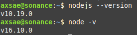

# dissonance-discord
dissonance discord bots, for extra utility


Install Node.js Locally with [Node Version Manager // nvm](https://heynode.com/tutorial/install-nodejs-locally-nvm/)


- tried using nodeenv, shii didn't work.

```
$ nvm use system
$ npm uninstall -g a_module

```
basically this is how you uninstall from the system Node


there's also difference between node and node.js




also installed nvm through 


then you just gotta invite your own bot
instructions to [self-invite](https://discordpy.readthedocs.io/en/stable/discord.html)


`/home/axsae/Documents/coding_projects/git/dissonance-discord/dissonance-discord/bih-sniper/package.json`

this is how scripts are named and executed.

```
{
	"name": "sniper",
	"version": "1.0.0",
	"description": "An easy to run simple bot that lets you snipe messages in your Discord server.",
	"main": "src/index.js",
	"scripts": {
		"register": "node scripts/register.js",
		"bot": "node src/index.js",
		"prettier": "prettier --write \"**/*.js\""
	},
	"repository": {
		"type": "git",
		"url": "git+https://github.com/DankMemer/sniper.git"
	},
	"author": "badosz0 <m@badosz.com>",
	"license": "MIT",
	"bugs": {
		"url": "https://github.com/DankMemer/sniper/issues"
	},
	"homepage": "https://github.com/DankMemer/sniper#readme",
	"dependencies": {
		"@discordjs/rest": "^0.1.0-canary.0",
		"discord.js": "^13.1.0"
	}
}

```


Need to install 

`npm install dotenv`
to load .env files from the project directory


Apparently I'm supposed to be using `yarn` and not `npm`

also installed `discordjs/rest` and `discord-api-types`